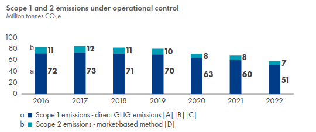
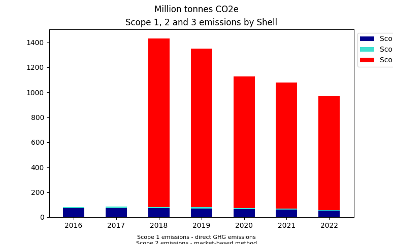

# ❓️ Why
People drown in unnecessary data or have unanswered questions!

> There is a shortage of intutive and easy to understand knowledge about our everyday lives!

People are overwhelmed with unnecessary information trying to understand an ever changing world with outdated views and understanding and no way of getting reliable information that helps them understand.

The world is flodded bullshit content, including data that tells you nothing!

Therefore we need more understanding for complex subjects that suround us daily!

Each data project here has one of the following:
- Clear research question (Gaining insights)
- Learning a new feature/skill. New data provider
- Creating a baseline dataset for later use!

## 💾 The technical Why
Build reliable and reusable tools to:
- Collection
- Processing
- Visualizing Data

Analyzing data, collecting data, processing & cleaning up data, visualizing data...
There a plenty of sources to get data from, chances are you will use similar ways to gather them in the future

Ideally this becomes a suite of python tools to collect data from different source such as:
- URLs
- Webpages / HTML
- PDFs
- Pictures / Videos
- Data Providers / Databases

And Visualizing Data:
- Plottype
- Legend
- Colorscheme
- Footnotes with URLs

## Knowledge is fluent, but most of our education isn't
The rules of math will stay the same as long as I breath.
Meanwhile reasons for building infrastructure or thelike will change depending on technology, cost, social acceptance, political issues, and so on.

However, many reports are ueless pieces of text.
And we wonder where all the working people are...
Busy transforming bullshit onto white paper.

Take Climate Actions by companies:
[Shell plc]:
> Target to become a net-zero emissions energy business by 2050

There are people, investors, bankers, people we trust with money reading this and thinking everything will be fine. I mean "net zero emissions", that's green, right?

No.

Net-Zero means eliminating your `Scope 1` and `Scope 2` emissions. `Scope 3` are the emissions due to your products sold!

In [[Shells]]'s "Achieving net-zero emissions" chapter there is a brief explanation what those three emission-categories are.
Then follows more wasted paper then rubbish explanations then when I complain about stuff in writing!
Shell boasts about their great efforts and go out of their way to show you lower emisison charts like this one:

I could explain how this is missleading in many ways, but chose to fix the chart instead!

Eliminating your `Scope 1` and `Scope 2` emissions would reduce the emissions `Shell` only about 5%.

How is that for

> doing business in an ethical and transparent way.

and supporting

> the more ambitious goal of the Paris Agreement [limiting global temperature rise to] 1.5 degrees

Well, more than 12 pages bousting about energy transition and downtrending graphs don't seem so relevant now, do they?

But this is the information your fund-manager, bank personal selling you a climate concious product or journalists will use to tell a diffrent story!

Funny how the whole webpage on "Greenhouse gas emissions" nor Shells published Sustainability reports don't include a single graphic visualizing the `Scope 3` emissions.
Meanwhile their "Sustainability Report" webpage let's you generate multiple charts... on their webpage!

🔗 URL: https://reports.shell.com/sustainability-report/2022/_assets/downloads/shell-sustainability-report-2022.pdf

Greenhouse gas emissions
🔗 URL: https://www.shell.com/sustainability/transparency-and-sustainability-reporting/performance-data/greenhouse-gas-emissions.html

## 🧩 Data is only part of understanding!
Asking questions is valuable, trying to answer them is the hard part.
Writing Code is just a necessary evil to get there!

## 💩 Most data viz is bullshit
Looking through pages like (DataIsBeautiful)[https://www.reddit.com/r/dataisbeautiful/] you find lots of nice graphics.

The Episode Scoreboard for `Breaking Bad` episodes and the average rating looks nice.
While a nice coding exercice, it is uterly useless!

Nobody cares about the Cloud-Marketshare of some services or a flow-chart of Amazons Income statement.
That graph and similar ones exist a thousand times online and at least once in the report from which the data comes from!
Far more valuable would be a question like
- "Are the onetime items recurring?" or
- "how does this compare to the last reports?"

While these simple graphs give you an immediate understanding for how big in context to other things are, but that 5 second insight is about it!

Meanwhile there are charts I like, that answer mutliple questions like the following:

by Robert Lawrence

The simple barchart that lists enriched Uranium in Iran it has added data like
- the amounts,
- precise events,
- additional measurements such as weight, percentage and enrichment status
- the JCPOA limit in kgs

Just by looking at this chart I learn the following things:
- There is something called JCPOA
- JCPOA is about Uranium apparently
- Iran has a history of building up enriched Uranium since 2015
- The US left the aggreement, since which, especially since 2019 Iran accumulated Uranium
- THere is a JCPOA limit on Uranium

Iran's Growing Stockpile of Enriched Uranium Since the End of the JCPOA [OC]:
🔗 URL: https://www.reddit.com/r/dataisbeautiful/comments/18nrv49/irans_growing_stockpile_of_enriched_uranium_since/

Blogpost
🔗 URL: https://cognitivefeedbackloop.com/so-iran-is-enriching-lots-of-uranium-these-days-should-we-be-worried-3403598a527f

Robert Lawrence Personal Page:
🔗 URL: https://www.robertlawrencephd.com/

## 🤔 Why opinionated?
I usually look at data to answer a question or settle an argument.
That context lives throughout the analysis and visualization.
Answering simple questions may result in consulting 5 different datasources.

Those sources have differing viewpoints and limitations which MUST be explained!
Nowadays there is so much data, but even more that hasn't been correlated in a clera and concise matter.

EXAMPLE:
Why were there more car accidents on a given Autobahn-segment?
One possible answer might be the recently lifted speedlimit. (We have sections without speedlimits here)
After all, higher speeds = more crashes?

However, looking at the data you might realize most crashes occur at speeds far below the speedlimit.
Correlating that observation with the usage (aka capacity) of that segemtn may lead to the far simpler "The street is simply overrun", explaining the lower speeds and the amount of accidents.
